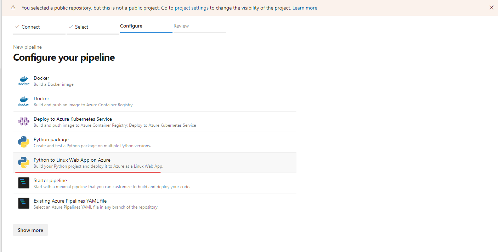

# Overview

<TODO: complete this with an overview of your project>
In this project, you will build a Github repository from scratch and create a scaffolding that will assist you in performing both Continuous Integration and Continuous Delivery. You'll use Github Actions along with a `Makefile`, `requirements.txt` and application code to perform an initial lint, test, and install cycle. Next, you'll integrate this project with Azure Pipelines to enable Continuous Delivery to Azure App Service.

This project will give you an opportunity to demonstrate your ability to perform continuous delivery for a Python-based machine learning application using the Flask web framework.

## Project Plan
<TODO: Project Plan

* A link to a Trello board for the project
* A link to a spreadsheet that includes the original and final project plan>

## Prerequisites
* An Azure account
* An GitHub Account
* An Azure DevOps account, which is already has the parallel agent enabled

## Architectural Diagram
### CI using GitHub Actions (SaaS CI/CD service)


### CI/CD using Azure Pipeline (Cloud native CI/CD service)


## Instructions
### Setup environment
1. Fork this repository
2. Create a free Azure Cloud shell resource on Azure Portal (use Bash)
3. On the cloud shell environment, create a SSH keys: `ssh-keygen -t rsa`
4. Get the generated key (in the `~/.ssh/id_rsa.pub` file) and add it to your GitHub repository. 
5. Clone the forked project to the cloud shell: `git clone git@github.com:<Your-GitHub-account>/udacity-project2.git`


### CI using GitHub Actions (SaaS CI/CD service)
1. Change the branch to the "simple-CI": `git checkout simple-CI`
2. Test on local:
    - Create virtual environment: `python3 -m venv venv`
    - Activate the virtual environment: `source venv/bin/activate`
    - Run the Makefile: `make all` - the result should be like below
    
3. Test on GitHub Actions: 
    - Make any change (ex: add a white space on the README.md file...) on the simple-CI branch
    - Then the CI pipeline on GitHub Actions will automatically be triggered like belows:
    
    

### CI/CD using Azure Pipeline (Cloud native CI/CD service)
1. Change the branch to the "main": `git checkout main`
2. Create Webapp resource on Azure Portal or directly on Azure Cloud shell:  
```az webapp up -n <Your-Webapp-name> -g <Your-resource-group-name> -l <Your-preferred-location> --sku F1``` (This is free tier, you can create another plan)
3. Change `the make_predict_azure_app.sh` file to pointed to your created App Service:

4. Create a CD pipeline on the Azure DevOps pipeline:
* Connect to your GitHub repo


* Connect to your Azure App Service



* Update the pythonVersion variable to match your current Web App

5. Save and run the pipeline. 

<TODO:  Instructions for running the Python project.  How could a user with no context run this project without asking you for any help.  Include screenshots with explicit steps to create that work. Be sure to at least include the following screenshots:

* Project running on Azure App Service

* Project cloned into Azure Cloud Shell - PASSED

* Passing tests that are displayed after running the `make all` command from the `Makefile` - PASSED

* Output of a test run - PASSED

* Successful deploy of the project in Azure Pipelines.  [Note the official documentation should be referred to and double checked as you setup CI/CD](https://docs.microsoft.com/en-us/azure/devops/pipelines/ecosystems/python-webapp?view=azure-devops).

* Running Azure App Service from Azure Pipelines automatic deployment

* Successful prediction from deployed flask app in Azure Cloud Shell.  [Use this file as a template for the deployed prediction](https://github.com/udacity/nd082-Azure-Cloud-DevOps-Starter-Code/blob/master/C2-AgileDevelopmentwithAzure/project/starter_files/flask-sklearn/make_predict_azure_app.sh).
The output should look similar to this:

```bash
udacity@Azure:~$ ./make_predict_azure_app.sh
Port: 443
{"prediction":[20.35373177134412]}
```

* Output of streamed log files from deployed application

> 

## Enhancements

<TODO: A short description of how to improve the project in the future>

## Demo 

<TODO: Add link Screencast on YouTube>


